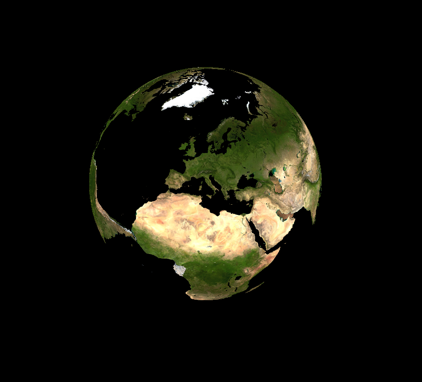

LISA
====

LISA Is a Simulation Analyzer written in Python, C and OpenGL/GLSL.

Introduction:
=============

LISA is an program written in Python and C for interactive
visualization of large datasets from numerical simulations in 2D or 3D. The
goal is to provide a simple interface in command line for manipulating and
scripting data analysis, as well as with a graphical interface to connect
analysed data to user defined events. The user will have the possibility to
create its own graphical interface in a few lines for a particular numerical
simulations, through a simple plugin system.

LISA will also provide a large library of tools for
manipulating and analysing data, as creating various trees for easily
selecting some portions of the data, defining some meshes as predefined
regular grid or extract it from datasets with Delaunay triangulation.
This allow an easy creation of isosurfaces, interactive selection of data...

But the OpenGL/GLSL interface let us do a lot of things not only related
numerical simulations. The API provided by LISA will be very similar to a
game engine, giving to LISA the limitations of our imagination. Below are
some screenshots of what can be done with LISA.

Dependencies:
=============
- python-opengl
- sld2
- Cython
- numpy
- PyQt4 (optional)

<!-- vim: spelllang=en -->
